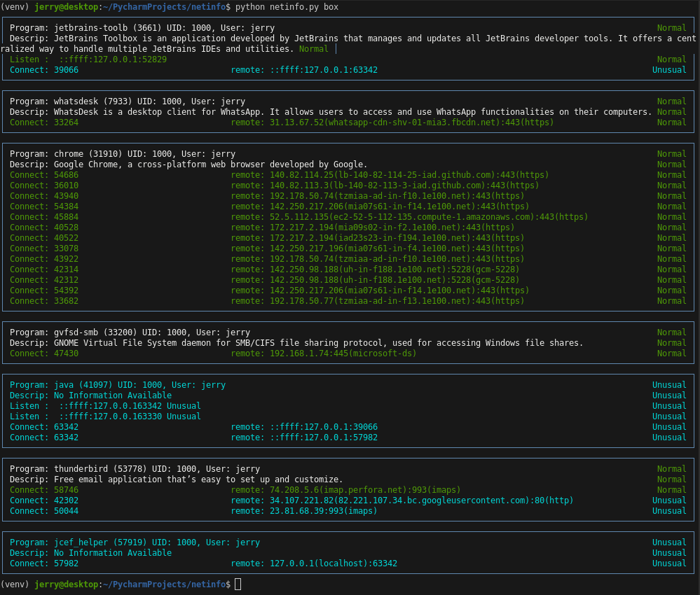

# netinfo
Watch You local network usage comparing it against what is Normal.

The idea is to watch you network in real time and match the current network pattern against a predefined pattern.  In this way we can Identify when your system attempts something different.

## Here an example run


## Explanation of the Example
1. The programs NetworkManager, postgres, cupsd, systemd-resolve, sshd, and chrome are all using the network as expected.
2. The program jcef_helper has no description in program_info.json and therefore is considered not to conform to Normal operations.

## Next Steps
1. Increase the number of programs in program_info.json.  
    **Note:** that this is easily done by setting up a chatGPT session to which you copy the undefined program section, and ask chatGPT to update the program_info.json
2. Create a realtime version that constantly watches for unknown network processing.
3. Investigate what similar static program definitions exists.
4. Add Check for known illegal sites: https://iplists.firehol.org/
5. use the official site for servcice translations: https://www.iana.org/assignments/service-names-port-numbers/service-names-port-numbers.xhtml
6. In the following output section for chrome, find out what each of those server are and what data is transferred. 
```
┌────────────────────────────────────────────────────────────────────────────────────────────────────────────────────────────────────────────┐
│ Program: chrome (31910) UID: 1000, User: jerry                                                                                      Normal │
│ Descrip: Google Chrome, a cross-platform web browser developed by Google.                                                           Normal │
│ Connect: 54686                               remote: 140.82.114.25(lb-140-82-114-25-iad.github.com):443(https)                      Normal │
│ Connect: 36010                               remote: 140.82.113.3(lb-140-82-113-3-iad.github.com):443(https)                        Normal │
│ Connect: 43940                               remote: 192.178.50.74(tzmiaa-ad-in-f10.1e100.net):443(https)                           Normal │
│ Connect: 54384                               remote: 142.250.217.206(mia07s61-in-f14.1e100.net):443(https)                          Normal │
│ Connect: 45884                               remote: 52.5.112.135(ec2-52-5-112-135.compute-1.amazonaws.com):443(https)              Normal │
│ Connect: 40528                               remote: 172.217.2.194(mia09s02-in-f2.1e100.net):443(https)                             Normal │
│ Connect: 40522                               remote: 172.217.2.194(iad23s23-in-f194.1e100.net):443(https)                           Normal │
│ Connect: 33078                               remote: 142.250.217.196(mia07s61-in-f4.1e100.net):443(https)                           Normal │
│ Connect: 43922                               remote: 192.178.50.74(tzmiaa-ad-in-f10.1e100.net):443(https)                           Normal │
│ Connect: 42314                               remote: 142.250.98.188(uh-in-f188.1e100.net):5228(gcm-5228)                            Normal │
│ Connect: 42312                               remote: 142.250.98.188(uh-in-f188.1e100.net):5228(gcm-5228)                            Normal │
│ Connect: 54392                               remote: 142.250.217.206(mia07s61-in-f14.1e100.net):443(https)                          Normal │
│ Connect: 33682                               remote: 192.178.50.77(tzmiaa-ad-in-f13.1e100.net):443(https)                           Normal │
└────────────────────────────────────────────────────────────────────────────────────────────────────────────────────────────────────────────┘

```

## Done
1. If description does not fit in one line it is broken into 2 lines.

2. Implement version using osquery:
   - Allow for os independence (MACOS, WINDOWS, LINUX)
   - Allow for a much better structured interface to os than executing unix mini commands and parsing the output.
2. rewrite color handling.  now uses colored.

